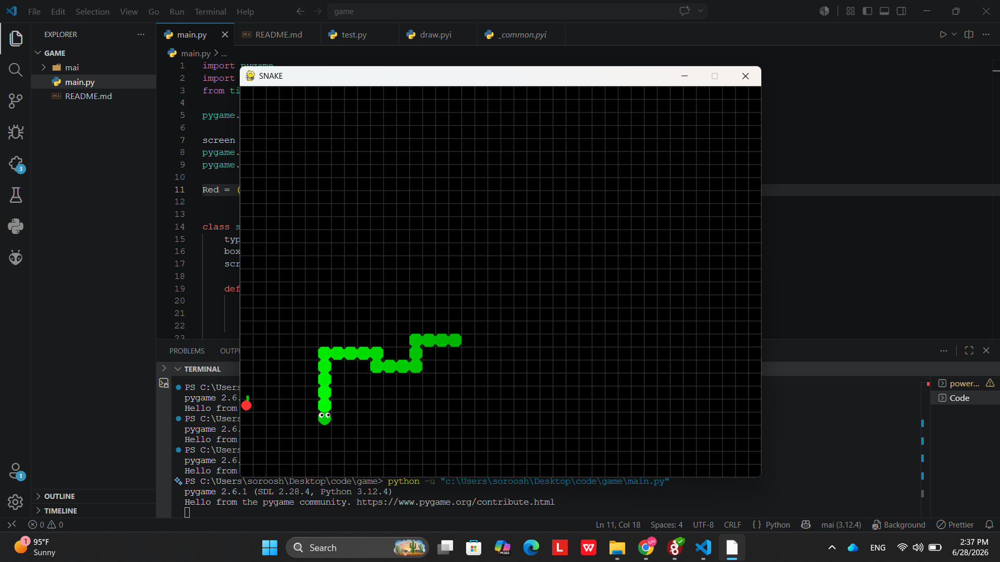

# 🐍 Snake Game

A modern implementation of the classic Snake game built with **Python** and **Pygame**.

## 📌 Features

* Smooth snake movement
* Food generation at random positions
* Snake growth after eating food
* Collision detection:

  * Wall collision
  * Self collision
* Beautiful grid-based interface
* Custom snake head design with eyes
* Dynamic body coloring

## 🖼️ Screenshot

Add a screenshot here:

```md

```

---

## 🚀 Installation

### 1. Clone the repository

```bash
git clone https://github.com/soroush185/snake-game.git
cd snake-game
```

### 2. Install dependencies

```bash
pip install pygame
```

### 3. Run the game

```bash
python main.py
```

---

## 🎮 Controls

| Key            | Action     |
| -------------- | ---------- |
| ⬅️ Left Arrow  | Move Left  |
| ➡️ Right Arrow | Move Right |
| ⬆️ Up Arrow    | Move Up    |
| ⬇️ Down Arrow  | Move Down  |

---

## 🛠️ Built With

* Python 3
* Pygame

---

## 📂 Project Structure

```text
snake-game/
│
├── main.py
├── README.md
└── screenshot.png
```

---

## 📚 Concepts Used

* Object-Oriented Programming (OOP)
* Game Loop
* Collision Detection
* Random Food Generation
* Event Handling with Pygame

---

## 🔮 Future Improvements

* Score system
* High score saving
* Start menu
* Pause feature
* Sound effects
* Difficulty levels

---

## 👨‍💻 Author

Developed by **[Soroush]**

GitHub: https://github.com/soroush185

---

⭐ If you like this project, don't forget to give it a star.
